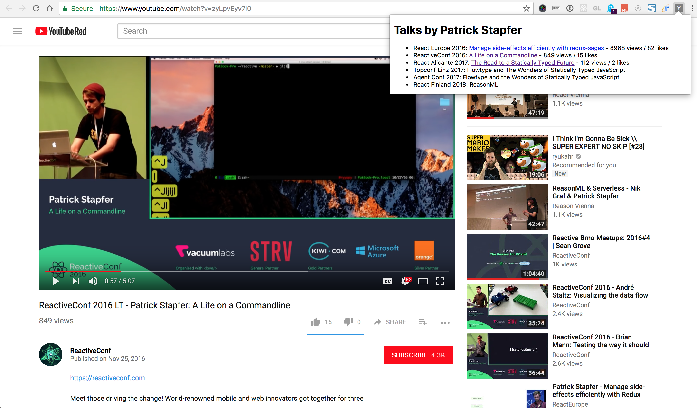

# OneProfile

## Setup a OneGraph app:

Sign up at https://www.onegraph.com, create an app, and grab its id.

Open `src/config.re` and put the appId in there.

## Run this project:

```
npm install
npm start
# in another tab
npm run webpack
# in *another* tab if you don't want the chrome extension version
npm run serve
```

Visit the npx url and it'll show you the related talks to the id set
in `index.re`


## Loading the Chrome extension

In Chrome, you can add an unpacked extension, just add the root
directory (with the `manifest.json` file) as the extension. You should
get a icon added to your toolbar that'll work if you click it when
you're at a Youtube video.

Note that it'll initially not work because you need to set the allowed
CORS origins for your app. Right-click on the icon, click "Inspect popup",


 and you'll see in the console an error like:

```
Failed to load https://serve.onegraph.com/dynamic?app_id=6c510423-45bc-4f46-af1b-54bc1676c10c: Response to preflight request doesn't pass access control check: No 'Access-Control-Allow-Origin' header is present on the requested resource. Origin 'chrome-extension://jdaipnhimjnhdnionekkakggdbdmpaba' is therefore not allowed access. If an opaque response serves your needs, set the request's mode to 'no-cors' to fetch the resource with CORS disabled.
popup.html:1 
```


Back in https://www.onegraph.com/dashboard just add
`chrome-extension://<randomly-generated-id-from-above-console-error>`
to your app's CORS origins, and you should be good to go.


## Examples





